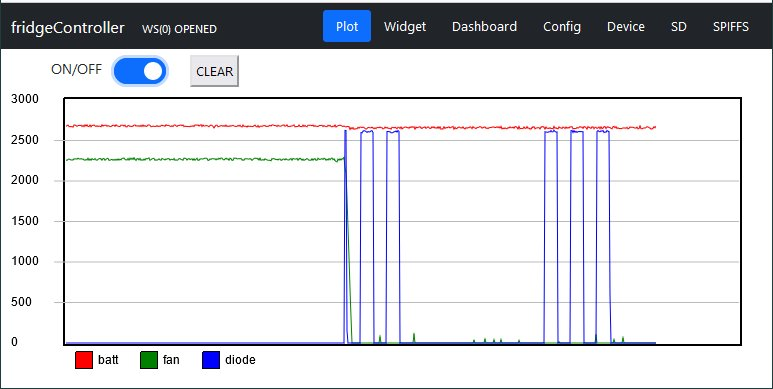

# Analysis of Danfoss/Secop Inverter Behavior

**[Home](readme.md)** --
**[Design](design.md)** --
**[Electronics](electronics.md)** --
**[Build](build.md)** --
**[Notes](notes.md)** --
**[Analysis](analysis.md)**

Unfortunately there are no schematics of the Danfoss Inverter and so I have had
to reverse engineer it's behavior empirically.   I have two different units.
There is an **101N0212** currently on the pump.  I also have a spare **101N0220**
I used for reverse engineering on my desk (without a compressor).

### A. Inverter Pins

The Inverter has the following blade connectors, from top to bottom:

- **BATT-** - GND. connected directly to the 12V battery negative (in my case, a negative shunt)
- **BATT+** - connected to the 12V battery positive thru a fuse (in my case a 15A breaker)
- **FAN/DIODE+** - goes, basically, to BATT+, when there is power to the inverter
- **FAN-** - pulled towards ground (to BATT+ minus 12V) via a regulator, to turn the fan on.
  Current limited to 0.7A with 1A surges allowed for a few seconds.
- **DIODE-** - pulled to ground to flash a led.  Current limited to 10ma.
- **C** - common thermostat terminal. At ground potential.
- **P** - optional battery cutoff resistor to C. At 5V potential. With no resistor the default
   battery cutoff is 9.6V.  With a 33K resistor it is something like 11V.
- **T** - thermostat terminal. has 5V potential. Short to C gives 2000 rpm, 1.5K resistor to C gives
  max 3500 rpm

### A1. Cutoff Voltage

The documentation "standard battery protection settings" says that the
default cutoff is 10.4V, restored at 11.7V, and can be adjusted with a
resistor between C and P as shown in tables.

On my 101N0220, the inverter, with no connection, appears to cut out at
10.3V and come back on at 12V, which is close to the documentation.

I tried shorting C and P, and a few resistor values, and the table appears
to be roughly accurate.

The Waeco controller board I am replacing had a 1.5K resistor between C and P,
but I am leaving it out, in favor of the defaults, in my new implementation.
There is a blank place to solder a resistor into the MiniBox for an fixed
alternative voltage cutoff.

### A2. FAN/DIODE+

I measure less than 1/2 ohm between this and BATT+.  That is likely within
the limits of my meter, connections, wires, and probes.  So, basically,
I believe BATT+ and FAN/DIODE+ are connected inside the inverter.

Varying BATT++ from 10 to 14V on my power supply causes FAN/DIODE+ to track
the change exactly as far as I can tell.

I will use FAN/DIODE+ as a proxy for the BATT+ voltage to the inverter
for displaying the battery voltage.

### A3. FAN-

The documentation says that a fan connected between FAN/DIODE+ and FAN- will
get 12V of regulated power, 0.7A continuous with 1A surges allowed, and that
the inverter will fault and give a 2 flash error code if the fan draws more
than 1A.

So, it appears FAN- is pulled low, through a 12V regulator, with current sensing,
probably a low ohm shunt, and turned on and off via a mosfet or internal relay.
Note that the FAN will not turn on at all if the BATT++ (==FAN/DIODE+) voltage
is too low and the unit gives a 1 flash error code.

Otherwise, as measured on an oscilloscope, the FAN never receives more than
12V when FAN- is pulled down, and there is a small voltage offset required
for the 12V regulator.   Therefore, for example, if the battery is
14V, FAN-, when on, will be -12V relative to FAN/DIODE+ and approximately +2V
relative to BATT- (ground).

As BATT+ (and hence FAN/DIODE+) falls below 12V, but remains above the battery
cutoff, the fan receives less than 12V.   At 11V of BATT+, for example, it
gets about -10.5V relative to FAN/DIODE+, and it is still about 0.5V above
ground.

### A4. DIODE-

Likewise, DIODE- is pulled to ground, relative to DIODE/FAN+, in order to
flash the red diagnostic LED.   The documentation mentions that this is
automatically current limited to 10ma.

I measured this with an oscilloscope, and it indeed drops to ground potential.
I believe there is a 1K or so internal resistor in the inverter on the DIODE- pin.

This is because I have had success hooking a regular 5V LED directly between
DIODE/FAN+ and FAN-, and I have never burnt one out.  There was no resistor used
on the Waeco controller board I am replacing, and that diode lights up fine
with 5V through a 220 ohm resistor, which further confirms my supposition.

FWIW there is no such thing as a "12V diode", even though you will see it
mentioned on various websites.  What these folks apparently mean is a
regular LED with a series resistor (around 1K) soldered to one leg and
covered with heat-shrink tubing.  I don't think the extra resistor is needed,
and would only serve to make the LED dimmer.

### A5. C-T connection (pump on & speed)

Shorting the **C** and **T** pins will cause the pump to (start as needed and)
run at the lowest 2000 RPM.  Placing a resistor across these terminal
will cause it to run at higher RPMS.  According to the docs, a 1.5K resistor
will cause it to run at 3500 rpm.

It is actually based on the current.  It is difficult to actually measure
the pump RPMs (especially with no pump hooked up!) to test this.

Note, FWIW, that the T pin actually appears to be driven to +5V relative to
BATT- (ground), probably by a 5V regulator and that the P pin appears to
be at the same potential, probably through a 10K resistor, guessing
from the battery protection resistor values.

### A6. PWM to control C-T current

Although the simplest physical way to control the compressor speed is
the use of a fixed resistor between the C and T pins, with a dead-short
equaling 2000 rpms (min), and a 1.5K resistor equaling about 3500 rpms (max),
the doc mentions that the compressor speed can be controlled by PWM,
and it is actually the current flowing between the T and C pins that
is important.

This is great news, because it means that you can vary the compressor
speed (and turn it on and off) with a simple NPN transistor with the
collector connected to T, the emitter to C, and a PWM signal coming
from the MPU to the base (thru a 4.7K resistor).

Which means that a bulky and difficult to use relays and fixed resistors,
and/or digital potentiometers are not needed to control the compressor
speed.  The implementation of the PWM signal is documented in the
C++ source code.

## B. Starting, Running, and Errors

The behavior of the inverter is complicated and difficult to explain.
Here is a plot showing the
FAN/DIODE+ **red**, FAN- **green**, and DIAG_DIODE **green** lines,
showing the raw (0..4095) samples at the corresponding input pins
on the ESP32, during a failed startup attempt.

**(a) INITIAL STATE  (no C-T connection)**

Assume that the inverter is powered up with no connection (thermostat)
between the C and T pins.

In this state it will NOT detect an under-voltage.  It brings FAN/DIODE+
upto BATT+, whatever that is.  It brings the T and P pins upto 5V through
a 5V regulator (so they would be below 5V if the BATT+ was less than, say,
6V or so).

The LED is not flashing (DIODE- is not pulled down) and the FAN is not
running (FAN- is not pulled down).  This is visible on the left of the
above plot as the **red** line (FAN/DIODE+) is high, the **green** line
(FAN-) is high and the **blue** DIAG_DIODE line (DIODE- inverted by miniBox
transistor) is low.

It is only when the C&T pins are connected (a current flows from T to C),
that a "startup attempt" will be made, and it is only after a startup
attempt that an under voltage will be detected (and/or cause 1 flash
of the diode).

**(b) STARTUP ATTEMPT (C-T connected)**

The fan is turned off if it is on. The error_state is reset to zero and the
diode stops flashing. There is a delay of a few seconds before anything else happens.

Then, if BATT+ is lower than the cutoff voltage, the diode will
start flashing once every four seconds and nothing else will happen. We call this
error_state(1).

Otherwise, with sufficient voltage, it then briefly pulls the FAN- low to check
for a FAN over-current condition. If there is a fan over-current, it will go into
error_state(2), flashing twice every four seconds, and nothing else will happen.

Otherwise, the inverter makes three rapid attempts to start the pump.  If it
fails to start the pump, it starts the fan and goes into error_state(3),
flashing 3 times every four seconds  In the above plot, you can see the three flashes of
the LED as indicated by the **blue line**.

**(c) TIMED RESTART**

In an error_state, after 60-90 seconds, the pump will make another startup attempt.

**(d) Under-voltage and Fan Over-current**

These checks happen continuously in real time, during a startup attempt, as well
as while the pump is running normally. As soon as an under-voltage or fan over-current
is detected, the pump and fan will be turned off immediately.  However, if already
in an error_state (i.e. pending a restart attempt), the error_state (number of flashes)
will not change until the **next** startup attempt.

In other words, If an under-voltage or fan over-current occurs while there is an error_state,
the LED keeps flashing the old error_state, and will not start flashing the 1 or 2 flashes
for under voltage or fan over-current until the next restart attempt (60-90 seconds).

**(d) Voltage Restored**

If an under-voltage is restored while in an error_state, the fan will be started
immediately. A restart attempt will take place at the next 60-90 second interval.

**(e) ERROR_STATE**

To summarize, an ERROR_STATE is when the LED is flashing. Once an error state is
established it remains in place until the next 60-90 second restart attempt.

**(f) Toggling C&T**

The above descriptions assume that once C&T are connected, they stay connected.

However, I noted the following during testing.

C&T are normally connected and disconnected by a thermostat (the controller).
So, normally, the LED is not flashing and the pump (and fan) starts and stops
based on the CT connection.

If C&T are disconnected while in an error_state, the FAN will stop, but the
LED will keep flashing the error_state.

However, EVEN IN AN ERROR STATE, if C&T are disconnected then re-connected,
the inverter will immediately do a new start attempt (which has a built in
few seconds of delay).  Note that this subverts the 60-90 second automatic
restart attempt.

Thus, one way to clear an error state, and return the inverter, more or less to
its INITIAL STATE is to toggle the C&T connection.  If the re-connection is
brief, after the fan turns off, but before the delay until the actual
restart attempt happens, essentially this clears the error_state and
(more or less) returns the inverter to its initial state.

[**Done!!**](readme.md) Back to the beginning ...
