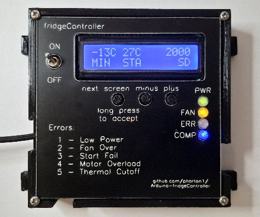

# Building the fridgeController

**[Home](readme.md)** --
**[Design](design.md)** --
**[Electronics](electronics.md)** --
**Build** --
**[Notes](notes.md)**--
**[Analysis](analysis.md)**

All parts were printed on my Prusa MK3s printer.  The covers
(tops) of the boxes were engraved and cut on my
[cnc20mm](machine) with my new
LaserTree [30 Watt]() laser.

The miniBox was printed out of PETG due to its higher temperature
resistance.  The rest of the parts were printed out of black, or
clear, PLA.  The small parts were printed at 0.2mm layer heights
in "Quality" mode.  The large parts (boxes) were printed at 0.3
layer heights in "Draft" mode.

The tops are engraved into 1/16" Black on White Rotar Engraving Stock
(Duets by Gemini) at 1200mm per minute and 18% power, and cut out at
200mm per minute at 95% power.

After 3D printing the parts, and Laser engraving and cutting the
tops, we proceed to the assembly and installation stages.

## A. Assemble the miniBox

Here are the steps in assembling the miniBox

- *super glue* the miniBox **Lens** into the *miniBox Cover*
- *hot glue* the miniBox **Lens Shield** to the *miniBox PCB*
- *epoxy glue* the miniBox **Base Bottom** to the **Base Top**.
  Use some *1mm metal wire* through the PCB screw holes to
  align the parts while gluing.
- insert the PCB into the miniBox and secure it with **four tiny
  M1.7x3** self tapping screws
- align the miniBox Cover onto the base and secure it with
  **four M3x5** self tapping screws.
- **remove** the Cover screws and *remove the Cover* in prepration for
  *installation*

## B. Assemble the Controller Box

If you haven't already done so, prepare the PCB as follows:

- attach the *LCD Mount* to the Controller PCB board with **three
  M3x5** self tapping screws **from the back*.
- insert the *LCD* onto the PCB and secure it with **three M3x5**
  self tapping screws from the top.
- place pieces of **black electrical tape** on each end of the LCD
  to minimize stray backlight from showing
- *epoxy glue* the Controller **Button Caps** onto the PCB buttons
- *hot glue* the Controller **Lens Shield** to the *Controller PCB*

Then you can:

- *super glue* the Controller **Lens** into the *Controller Cover*
- insert the PCB into the Controller Box and secure it with **three M3x5**
  self tapping screws, and **one M3x16** machine screw in the upper right
  corner through the *LCD and LCD mount*
- align the miniBox cover onto the base and secure it with
  four **M3x5** self tapping screws.
- **loosen** the Cover screws and *remove the Cover* in prepration for
  *installation*

## C. Installation

Before installation you must **turn off** the inverter **main power supply**.

### miniBox installation

We will first install the miniBox and make sure it works correctly
Start by making sure the mount is correct.

- Thread **four M3x12** self tapping screws into the miniBox *Base Bottom*
  until they are protude slightly out on the inside. The ones on the back
  should protude a bit more.  The miniBox should fit snugly atop the inverter

Then prepare the wiring:

- Preprate the **power supply Tees** and **2A inline fuse**
- Attach a **Pheonix 2 Pin** screw connector to the *power supply Tee wires*.
  **MAKE SURE THE POLARITY IS CORRECT** with the *Negative* **Black** on the
  top, and *Positive 12V* **Red** on the bottom, as facing the miniBox,
- Attach a **Pheonix 2 Pin** screw connector to the *power supply Tee wires*.
  **MAKE SURE THE POLARITY IS CORRECT** with the *Negative* **Black** on the
  top, and *Positive 12V* **Red** on the bottom, as facing the miniBox,
- Connect the **Custom Blade Connector** to the *inverter* and it's
  **6 pin JST connector** to the *miniBox PCB*.
- Plug in the two **Pheonix Connectors**.
- Make sure the *Override and Low/High switches* are both **OFF** (in the down position)
- *Without attaching the miniBox Cover*, slightly tighten the miniBox base screws
  so that they engage the *inverter box* and the miniBox is securely attached.

### FIRST STARTUP

When *you are sure* everything is correct, turn on the inverter
**main power supply**.

At this point the **Green** *Power LED* on the miniBox should come on.

You may now change the *Override switch* to the *ON* (Over) position.
After a few seconds the **Yellow** *FAN LED* should come on, and
the **Red** *ERROR LED* should **NOT BE FLASHING!!**.

**Congratulations!!** This means the compressor is on, and running.
You may leave it on until you notice some cooling occuring in the
system if you wish.

When you are ready to proceed to the next
step, **turn the main inverter power supply off**.

You may now

- attach the **8 pin** miniBox to Controller cable JST connector
  *to the miniBox*
- align the *miniBox* cover and secure it with the **four M3x5**
  self tapping screws.

  
### Controller Installation

To install the controller you must first make sure the temperature
sensors and all relevant wires are routed correctly to the location
where the Controller will be installed.

- insert the **Freezer Temperature Sensor** into the Freezer
  a few inches from the top of the insulated compartment and
  route its wire and connector.
- physically attach the **Compressor Temperature Sensor** (somehow)
  to the compressor and route its wire and connector.
- mount the **External LED** assembly and route it's wire and
  connector.
- route the **Mechanical Thermostat** wire and connector.

**Plug in all connectors** (especially the *6 pin miniBox JST
connector* and the *2 pin power supply JST connector)*.

*It is beyond the scope of this document to explain the rest
of the steps involved with installing, testing, and using
the fridgeController in detail.*
Basically, we will just tell you to ...

- **Turn on the inverter power supply**

... after which the Controller should boot up and all the
relevant LEDs should come on properly.  If you have not already done so, you
will need to attach the myIOTDevice to the Wifi LAN as a station.

You should now be able to control the compressor from the **webUI**,
**via Telnet**, from a **Serial Monitor** over a USB cable, and
through the **buttons and LCD screen** on the Controller.
From the WebUI you should be able to see the *temperatures,
voltages, status*, and so on, use the **Plotter** to see
instantaneous changes, and/or use the **Chart** (Widget)
to see the history of the compressor behavior over time.

When everything is working well you may:

- **attach the Controller Cover** and tighten the cover screws
- **mount** the Controller with 4 M4x10 wood screws
- provide **stress relief** for the wiriting

and the system is considered to be **officially working!!!**

*Note:* the Controller cover mounting scheme is horrible,
requires **Cover Clips**, and **WILL BE REDESIGNED** the
next time I have to print the Controller Box.

[**Next:**](notes.md) Some various Notes about the fridgeController ...