# fridgeController Electronics

**[Home](readme.md)** --
**[Design](design.md)** --
**Electronics** --
**[Build](build.md)** --
**[Notes](notes.md)** --
**[Analysis](analysis.md)**

I didn't take any photos or significant notes during the breadboard
prototyping of the Controller board.  But in order to get it basically
working, and reverse engineer the Inverter(s) I used the Arduino Plotter
to see and understand the voltage changes at 5ms intervals.  This allowed
me to develop the code, for instance, to "count" the diagnostic diode flashes
to come up with the INV_ERROR integer, and understand how the voltages
and currents to and from the inverter work

## A. miniBox PCB

Schematic:

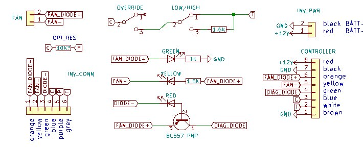

Most online documentation for the inverter has one connect a
diagnostic LED directly between the FAN/DIODE+ and DIODE- pins
from the inverter. This pair of pins is already current limited
within the inverter to about 10ma, so even though it is 12V,
it will not burn out a regular 5V LED.
However, it is fairly difficult to detect the DIODE- pin
being pulled down from a floating state to near 0V on an 3.3V
MCU (ESP32).

My solution is that, instead of being directly connected between
FAN/DIODE+ and DIODE- the (red) diagnostic LED is connected between
the FAN/DIODE+ and DIODE- pins through the collector and base of a
**PNP transistor**.  This way the emitter of the transistor cleanly
goes from 0V to 12V with the full current of the FAN/DIODE+ pin,
(which is current limited to 1A) and makes a much more reliable,
and easy to read, DIAG_DIODE signal for the Controller.

PCB:

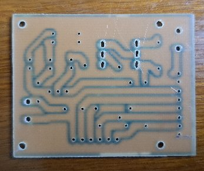
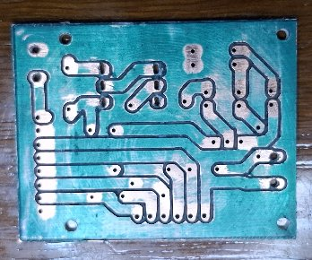

Soldered:

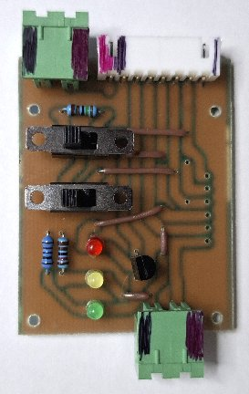
[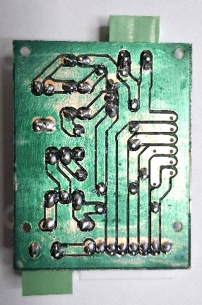](images/elec_miniBox_soldered_back_big.jpg)

After the initial PCB was created I noticed I had originally
routed the FAN DIODE incorrectly.  I jury-rigged a solution for the PCB
I had already created, but the photos above do not show that solution.
However, the schematics and PCB design been updated
with the correct routing.

## B. Controller PCB

Schematic:

[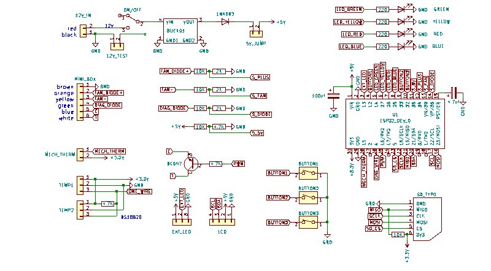](images/elec_board1_schematic_big.jpg)

PCB:

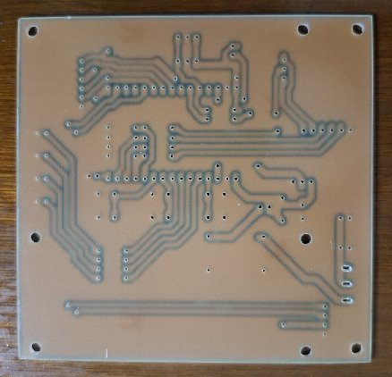
[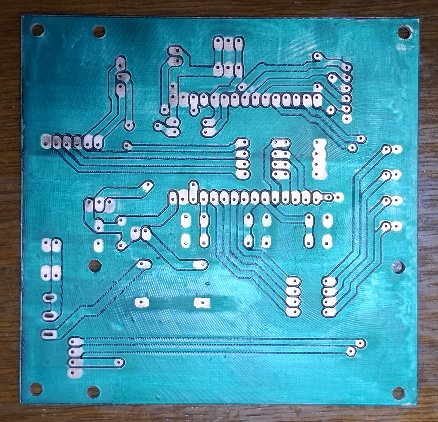](images/elec_board1_pcb_back_big.jpg)

Soldered:

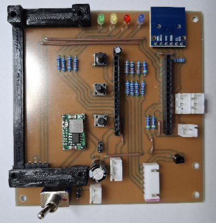
[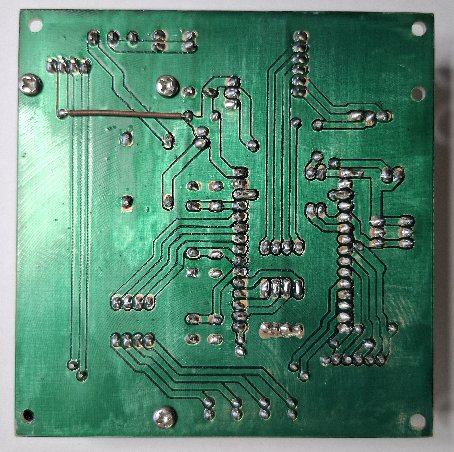](images/elec_board1_soldered_back_big.jpg)

Note that the **3D Printed LCD Mount** is attached to the PCB with 3 *M3x5* screws, from the back.  The fourth
hole is left unfilled at this time to allow attaching the PCB to the base of the 3D printed enclosure, through
the LCD mount, with a separate, longer, M3 screw.

After the initial PCB was created I noticed two problems.

- the **5V Routing to the LCD** would interfere with the LCD connector
- I needed a **5V power supply backflow preventer diode**

Both of these problems have been corrected in the kicad schematics and PCB
layouts. I jury rigged solutions to both of these on the
exiat PCB.  The first one is shown as the brown wire on the photo of the
bottom of the soldered Controller PCB above but the second one,
the addition of a 1N4003 backflow preventer diode is not shown
in the photos.

## C. Custom Connector and Cables

### Custom Blade Connector from Inverter to MiniBox

[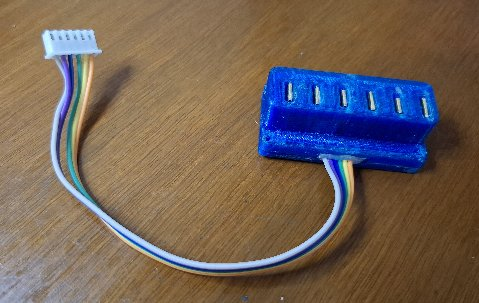](images/elec_customBlade_big.jpg)

### 8 Conductor Cable from MiniBox to Controller

[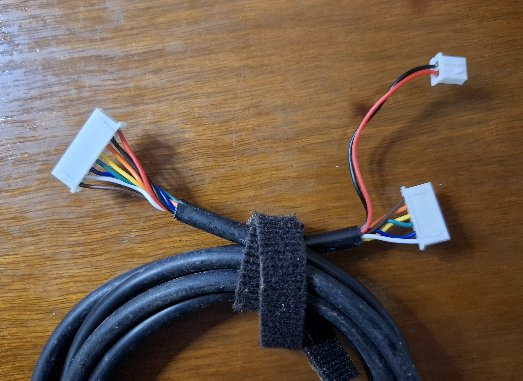](images/elec_miniBox_cable_big.jpg)

## D. Electronics Functional Overview

It all starts with the 8 pins on the 101N0212/101N0220 (Secop) Danfoss Compressor Inverter:

- **BATT-** - GND. connected directly to the 12V battery negative (in my case, a negative shunt)
- **BATT+** - connected to the 12V battery positive thru a fuse (in my case a 15A breaker)
- **FAN/DIODE+** - goes, basically, to BATT+, when there is power to the inverter
- **FAN-** - pulled towards ground (to BATT+ minus 12V) via a regulator, to turn the fan on.
  Current limited to 0.7A with 1A surges allowed for a few seconds.
- **DIODE-** - pulled to ground to flash a led.  Current limited to 10ma.
- **C** - common thermostat terminal. At ground potential.
- **P** - optional battery cutoff resistor to C. At 5V potential. With no resistor the default
   battery cutoff is 9.6V.  With a 33K resistor it is something like 11V.
- **T** - thermostat terminal. has 5V potential. Short to C gives 2000 rpm, 1.5K resistor to C gives
  max 3500 rpm

Most of these pins are brought directly to the Controller directly
through the miniBox.  The BATT- and BATT+ are brought to the miniBox
via "tees" from the wires to the inverter with 20 gauge wire.
The other 6 pins are from the inverter are brought to the miniBox thru
the Custom Blade Connector and through 22 gauge wires, to a 6 pin JST
connector.

### miniBox BATT+ inline fuse

We "tee" off separate wires from the BATT- and BATT+ into the inverter
to go to the miniMox 2 pin Phoenix connector.

The BATT+ to the inverter already has a 15A breaker near the battery bank,
but we also place a 2A fuse inline in the BATT+ sent to the miniBox for
added protection.

### FAN/DIODE+ has a (green) LED indicator

There is a (green) LED indicator from FAN/DIODE+ to ground (BATT-)
through a 1K resistor.  The LED comes on when the FAN/DIODE+ goes
high.

FWIW, in all of my experiments, the FAN/DIODE+ is a proxy for
the BATT+ level.  It tracks the BATT+ level well past 12V
in my experiments.

### FAN/DIODE+ and FAN- hooked directly to the FAN and Controller

The FAN/DIODE+ and FAN- JST pins into the miniBox are
connected directly to another 2 pin Phoenix connector to
the fan.  Note that FAN- is pull down to "FAN/DIODE+ minus
12V", and not necessarily to ground.  It is also current
limited to 1A by the inverter.

In addition, there is a (yellow) FAN indicator LED that is
connected between FAN/DIODE+ and FAN- with a 1.2k ohm current
limiting resistor.

Finally the FAN/DIODE+ and FAN- miniBox JST pins are connected
directly to the Controller's 8 pin JST connector on the miniBox.

### Temperature Sensors

There are two 3 pin connectors on the Controller board for
connecting DS18B20 temperature sensors.  Although there
are only two JST connectors on the Controller board,
they share the same OneWire interface,
and, in reality, upto 64 sensors *could* be connected to
the fridgeController, in Parallel to either, or both
of the two Controller board connectors.

### Controller Box Pin Inputs

In addition to having 12V (BATT- and BATT+) on a separate
2 pin JST connector on the Controller, 5 of the 6 remaining pins,
and an extra GND are brought to the Controller on a 6 pin
JST connector.

- BATT- (GND)
- FAN/DIODE+ (proxy for BATT+)
- FAN- (pulled towards ground, but never more than BATT+ minus 12V, when fan is on)
- DIAG_DIODE (pulled up to 12V when diode is on)
- C (directly from inverter/miniBox
- T (directly from inverter/miniBox

For sanity, we bring another version of the GND (BATT-) from
the miniBox to the controller board via the interconnect cable.

### PWM to control C-T current

Although the simplest physical way to control the compressor speed is
the use of a fixed resistor between the C and T pins, with a dead-short
equaling 2000 rpms (min), and a 1.5K resistor equaling about 3500 rpms (max),
the inverter doc mentions that the compressor speed can be controlled by PWM,
and it is actually the current flowing between the T and C pins that
is important.

This is great news, because it means that we can vary the compressor
speed (and turn it on and off) with a simple NPN transistor with the
collector connected to T, the emitter to C, and a PWM signal coming
from the MPU to the base (thru a 4.7K resistor).

This means that bulky and difficult to use relays and fixed resistors,
and/or digital potentiometers are not needed to control the compressor
speed.  The implementation of the PWM signal is documented in the
C++ source code.

## E. Integration Testing

I did several rounds of testing before Building the device with 3D
printed enclosures and actually installing it on the boat.

[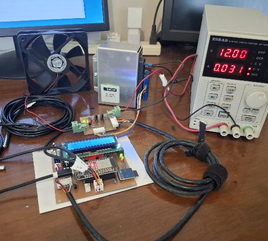](images/elec_integration_testing_big.jpg)

### Calibrate Buck Convertor

The first thing I did was attach a 12V power supply to the Controller PCB,
with **no ESP32 plugged in**, and used that to Calibrate the Buck Converter
to output 5.1V to the input pin of the 5V jumper.  Later, after I
added the **1N4003** backflow protection diode I had to calibrate the
Buck Converter again.

### Basic ESP32 testing and LCD Contrast Setting

I then plugged an **ESP32** into the PCB and powered it from my Laptop USB
cable, running a Serial Monitor to see that it was booting correctly.

Then plugged in the **1602A LCD** and rebooted, noting that I couldn't
see any characters.  After unplugging the LCD and turning the *Contrast
Potentiometer* on the LCD module all the way up, and plugging it back it,
I was able to see characters on it. I then re-iteravely
unplugged, adjusted the contrast, and re-plugged the LCD out and in
until I got a contrast I liked.

*Note that the ESP32 outputs about 4.6V to the "5V" pin when connected
to a 5.0V USB power supply!!*

Later when I installed the **5V** jumper and tested it with a 12V
power supply (and I noticed I needed the backflow prevention diode),
I had to re-adjust the LCD Contrast for the higher 5.1V output by the
Buck Converter.  I set it in the middle so that it looks ok, but
not perfect, whether the ESP32 is powered from the laptop USB
or via the 12V to 5V buck converter.

### Testing Temperature Sensors

I then moved the Controller over by my home refrigerator, added
JST connectors to two **DS1820B** temperature sensors, plugged them
into the Controller board and stuck one of the sensors in the freezer
of the refrigerator and positioned the other one (the "compressor"
temperature sensor) on the side of the refrigerator that gets hot
when the compressor runs.

[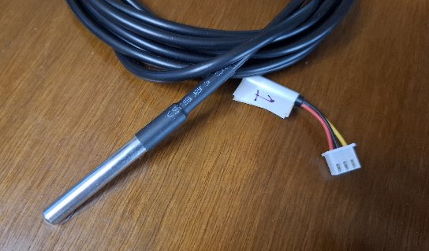](images/elec_tempSensor_big.jpg)

I ran this for several days (while I developed myIOT data logging
and charting) and was able to see a nice graph of the temperatures.

During this time I also built the **fakeCompressor** to allow me to
model the freezer and compressor so that I could refine and work on
the myIOT data logging and charting capabilities before going live.

### Bench Test the miniBox PCB

I had already made the **Custom Blade Connector** well before I even
made the PCBs, but I still had to add a JST connector to one end of it.

Once that was ready I plugged the inverter into a bench power
supply with T's of the Minus and Plus pins to a (screw) Phoenix
connecter, put a Phoenix connector on a 12V muffin fan, plugged
the Blade Connector into the inverter and it's JST plug into
the miniBox, plugged the FAN in, and powered it all up.

Nothing exploded or smoked!  When I turned on the **Override Switch**,
the Green POWER led came on, and as expected the Inverter tried to start
the (non-existent) compressor and failed.  The Red DIAG diode correctly
flashed three times every four seconds, and all was well.

Except the Yellow FAN diode never came on, which is when I discovered
I had routed it incorrectly.  After fixing that, the Yellow FAN diode
turns on when the Fan turns on, and turns off when the Fan turns off.

So the miniBox PCB appears to be working.

### Integration Test with Controller PCB

After many days of working on the fakeCompressor and messing around
with **jqPlot**, and writing my own **iotPlot.js** library, and making
the miniBox-to-Controller cable, I was ready to try to hook the Controller
up via the miniBox PCB to the actual inverter on my desk.

[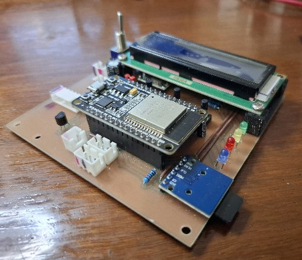](images/elec_PCB_populated_big.jpg)

I plugged it all in, including two temperature sensors, turned on the power supply,
and pretty much everything worked as expected.  I was able to see the instantaneous
**plot** of the voltages, and a nice chart of the temperatures (even though they
were just sitting on my desk at a near constant 30C).

I spent several days here just refining things, writing and expanding the
native LCD based UI, adding some features to the myIOT library, cleaning up
the code and debugging, and in general getting ready to actually try
it on the boat.

[**Next:**](build.md) Building the fridgeController ...
