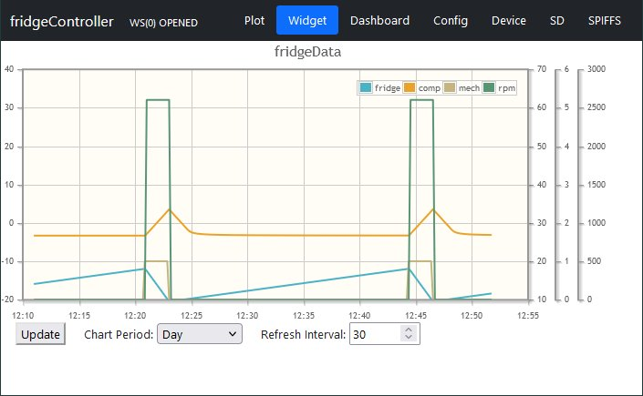
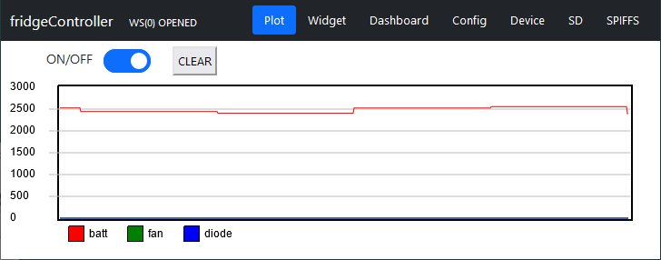
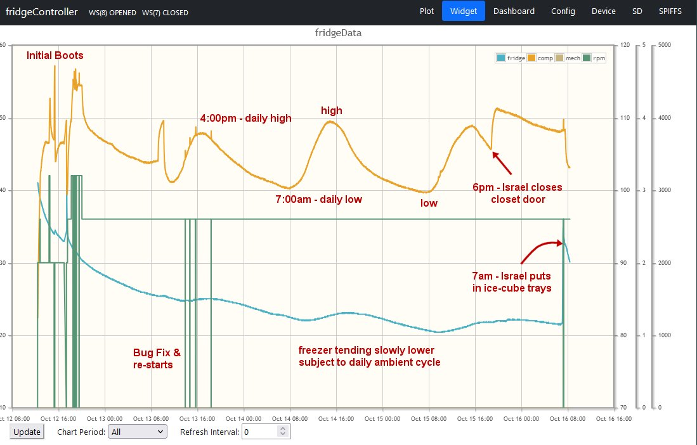

# fridgeController Implementation Notes

**[Home](readme.md)** --
**[Design](design.md)** --
**[Electronics](electronics.md)** --
**[Build](build.md)** --
**Notes** --
**[Analysis](analysis.md)** 

### A. New VALUE_STYLE_TEMPERATURE and DEGREE_TYPE style and value

The base
[myIOTDevice](https://github.com/phorton1/Arduino-libraries-myIOT)
now has a **DEGREES_TYPE** Value that can
be set by the user, and which may be *Centigrade* or *Farenheit*.
Degrees are tagged with the new **VALUE_STYLE_TEMPERATURE** style
and stored as VALUE_TYPE_FLOAT (32 bit floating point number) representing
a temperature in 1/128ths of a degree centigrade.

The Controller, WebUI and myIOTDevice UI will automatically display
and manipulate temperatures in the current DEGREE_TYPE as specified
by the user.

Note that DS18B20 temperature sensors essentially return a
signed 16 bit integer representing the temperature reading
in 1/128th degrees Centigrade, hence this myIOTDevice addition.

See fridgeController::tSense.cpp for a notion of how
complicated and programmable these sensors are, and
how I am using the boot-up defaults on the sensors I
have.

This notion is also extended into the myIOTDataLog object,
which now has an explicit type, **LOG_COL_TYPE_TEMPERATURE**,
for interpretation of logged data values by the webUI
javascript.

## B. Data Logging, Charting, and Plotting

A *bunch* of work was done to the
[myIOT library](https://github.com/phorton1/Arduino-libraries-myIOT)
to implement **Data Logging, Charting,** and realtime **Plotting**
in the WebUI, as well as a nascent notion of device specific **Widgets**.

These new capabilities have *not yet been documented* in the myIOT library,
although this device, and the
[Bilge Alarm](https://github.com/phorton1/Arduino-bilgeAlarm)
have been modified to implement Widgets and Charting, and
this device, and
[theClock3](https://github.com/phorton1/Arduino-theClock3) have
been updated to implement real-time plotting.

At this time, as a result, it is very likely that the
[myIOTServer](https://github.com/phorton1/base-apps-myIOTServer)
has been broken and will not work correctly, which is semi-intentional,
as my current plan is to rework the myIOTServer *away from being
a Websocket emulator* into more of a pure *socket forwarder*, as
I think it was **crashing often** on the rPi I use for it.

In any case, the myIOTServer is probably broken at this time.

## C. the fakeCompressor

In order to test the software, particularly the *Control Algorithms*,
*Data Logging*, and *WebUI **Charting and Plotting***, on a *bare ESP32*
without any PCB's, I spent quite a bit of time implementing the **fakeCompressor**,
which is included (by default) if the compile define *WITH_FAKE_COMPRESSOR=1*
is set when compiling the firmware.

The fakeCompressor feature can entirely be turned ON and OFF with
the *USE_FAKE* Value, and within the feature the emulated Compressor (12V power supply)
can be turned OFF and ON with the *FAKE_COMP_ON* Value.
When the feature is turned ON, **the code stops using the "real" Voltage (vSense.cpp) and
Temperature (tSense.cpp) sensors**, and instead, the fakeCompressor
outputs "fake" *FRIDGE_TEMP*, *COMP_TEMP*, and *MECH_TERM* Values
for use by the rest of the system.

As with the real compressor, if the power supply is turned OFF,
or the power supply is OFF and the *COMP_RPM* is zero (the compressor
is not running),  the freezer and compressor will move towards the
**FAKE_AMBIENT** temperature and level off at that temperature.

If the power supply is turned on, then the fakeCompressor is sensitive
to the *COMP_RPM* being set by the Controller, and when the COMP_RPM is
non-zero, the fakeCompressor will emulate the cooling of
the freezer, and heating of the compressor.

There are a number of **Values** that control the fakeCompressor
that are presented on the *Config* tab of the WebUI if the feature
is compiled in.

- **USE_FAKE** - *bool 0/1* - Whether to use the fakeCompressor or not.
- **RESET_FAKE** - *command* - A command to reset the fake Compressor to some initial values
  (FRIDGE_TEMP=-16C, COMP_TEMP=FAKE_AMBIENT)
- **FAKE_COMP_ON** - *bool 0/1* - Emulates turning the 12V power supply Off or On.
- **FAKE_AMBIENT** - *float, temperature, default(26.67C)* - the ambient temperature used for the model.
- **FAKE_PERIOD** - *integer, default(30)* - approximate number of seconds for a FRIDGE_MODE=TEMP or
  MECH cooling cycle

I have messed a lot with this stupid thing.  I have had luck with FAKE_PERIOD=10,
to show a 10 second cycle, and FAKE_PERIOD=30 to show a 30 second cycle. However,
modelling a real compresser/freezer combination is exceeingly complicated, and
so the model is not guaranteed to work over all ranges.

The remainder of the Values associated with the Fake Compressor, are listed here,
without descriptions or default values.  Please see fakeCompressor.cpp if
you really want to mess with this.

- **COOLING_ACCEL** - *float, -10000-10000*
- **WARMING_ACCEL** - *float, -10000-10000*
- **HEATING_ACCEL** - *float, -10000-10000*
- **COOLDOWN_ACCEL** - *float, -10000-10000*
- **MAX_COOL_VEL** - *float, -10000-10000*
- **MAX_WARM_VEL** - *float, -10000-10000*
- **MAX_HEAT_VEL** - *float, -10000-10000*
- **MAX_DOWN_VEL** - *float, -10000-10000*
- **FAKE_PROB_ERROR** - *integer 0..100, not implemented* -
  the odds of the fakeCompressor failing to start,
  or encountering a compressor error while running

The fakeCompressor emulates a warming-cooling cycle which takes
approximately **FAKE_PERIOD**, in seconds, to complete.  The
default is 30 seconds, or in other words, over about 30 seconds,
with the default SETPOINTS, the fakeCompressor FRIDGE_TEMP will warm
to the SETPOINT_HIGH, temperature, the MECH_THERM will be turned on,
and, depending on the FRIDGE_MODE and SETPOINTS, the Controller will
set the COMP_RPM to a non-zero value, turning the compressor on and
the fakeCompressor will cool the refrigerator, and heat the compressor
until the RPMs goes back to zero, ending the cycle.

Here is a chart with the default settings of TEMP_SENSE_SECS=30 and
FAKE_PERIOD=30 where you can clearly see the fridge temperature
(Blue line) rising until the SETPOINT_HIGH is reached, at which point
the fakeCompressor turns on the MECH_TERM (Gold line), and the Controller
turns on the COMP_RPM (Green line), at which point the COMP_TEMP (Orange
line) starts rising, and the FRIDGE_TEMP starts falling.

When the FRIDGE_TEMP hits SETPOINT_LOW, the Controller turns off the
COMP_RPM (the compressor gets turned off), and the temperature of the
fridge begins (slowly) rising, and the temperature of the compressor starts
(more quickly) falling, towards FAKE_AMBIENT.
This helps prove that the basic **FRIDGE_MODE**, **DataLogging** and **Charting**
software is working.

The fakeCompressor also outputs random values for the 5V and 12V power supplies so that **Plotting**
can basically be tested.  Here is an example plot where you can see the fake 12V
power supply slightly changing:

## D. Laser Cut Plastic Tolerances

Designed cut: 103x105
Actual cut:  101.5x103.4mm

The laser took about 0.75mm to the inside of the desired size.
All holes are bigger than desired.

## E. Post Installation Notes (Design Ideas)

After installing the controller and running the freezer for about 3 days
I have some general observations, largely specific to my boat.

- The freezer/refridgerator is poorly insulated
- The freezer cannot reach my design target setpoints of -12C and -20C
- The apparent largest determinant of compressor temperature is the ambient temperature
- The FAN as controlled by the Inverter leaves much to be desired
- I probably want additional sensors and another FAN

Here is the chart of the first 3-4 days of the temperature runs.  The blue line
is the freezer temperature ranging from about 40F down to 20F, the orange line is
the compressor temperature ranging from ambient 90F upto about 115F, and the
green line shows the RPMS, which have been tried at 2000, 2600, and 3200 rpms,
with most of the time being in the middle at 2600 rpms:

### Initial Boots - Compressor heats rapidly when turned off.

I actually ran it for a bit before the above chart, using just the miniBox.

So when I added and turned on the Controller for the first time, it starts with
the freezer around 40F, well below ambient, and the compressor
a bit above ambient at about 90F.  I started by running at the minimum 2000 rpms
just to get a feel for how it would work.  I briefly tried increasing the rpms
to 2600, and then to 3200, and tried turning the compressor on and off.

Most of the time if the green line drops to zero it indicates a reboot. However
it also drops to zero when I manually turn the compressor off.

This is when I noticed two important facts.

- if the Compressor is turned off, the **FAN goes off immediately**
- if the Compressor is turned off, it **rapidly heats up**

When the Compressor is stopped the fluid stops flowing through the
radiator, and so almost all cooling of the compressor itself
stops as the main cooling is from the fan blowing on the radiator.
Plus the FAN stops immediately, excacerbating the issue.

When the Compressor comes back on, it cools, relatively speaking,
fairly quickly as soon as the fluid starts flowing and the FAN is
turned back on.

This results in the spikes and sharp drops in the compressor temperature
in the above diagram during the *Initial boots*.

After the first few hours of messing with it, I decided to leave it at
**2600 rpms** for an extended period of time to see how the freezer
temperature would actually work. It took about *12 hours* to get below 32F
to a freezing range.

### Bug Fix & Restarts (effect of closet door)

The next morning I went to the boat and did some simple physical experiments.
The peak in compressor temperature around Oct8 at 8:00am is when I closed
the closet door, trapping all the heat of the compressor in the closet.
Subsequently I opened the closet door and the temperature of the compressor
dropped considerably.

It took **forever** for the temperature of the freezer itself to get
significant;y below freezing.

I was messing with the data logging code and introduced a crashing
bug, and so had to reboot the device several times during the day
as I resolved the bug.   By now I am clearly starting to see the
daily ambient temperature cycle in the chart. It has been about
95F during the day and perhaps 75F at coldest at night, and the
compressor temperature tracks the daily ambient temperature cycle.

You can also see the the freezer itself reflects that daily cycle
as it tends cooler overall, but has definite waves that correspond
to the daily cycle.  Nonetheless, the **lowest temperature I
have seen thus far has been about -6C or about 21F** which,
unfortunately well above my target SETPOINT_HIGH of -12C (10.4F),
much less my SET_POINTLOW of -20C (-4F) .

FWIW, the commercially built refridgerator in the apartment had
no problem reaching those kinds of tempertures and tended to cycle
between -12C and -20C.

### Israel Arrives - Ice Cube Trays

On Oct15 Israel arrived at the boat for his normal 4-day work week.
Nothing much changed, until about 6pm when he closed the closet door
causing the compressor temperature to rise noticably. I verified this
with him on the morning of Oct16, and last thing in the graph you
can see the compressor temperature drop rapidly after I opened the
closed door.

Regarding the freezer temperature, you see the normal daily cycle,
with perhaps a bit of overall warming. He probably opened and closed
the refridgerator several times while he was making dinner, which
apparently has no sharp distinction in the chart, but rather, I think,
caused the freezer to slighly increase in temperature.

Then, on the morning of the 16th, I made a small code change
and rebooted the system (where the green line drops to zero),
and coincidentally, at about that same point in time, Israel put
four fresh (warm water) ice-cube trays into the freezer.

I was alarmed at first, thinking the temperature change was due
to a code issue, but when went to the boot, I confirmed with him
that he had just happened to put the ice-cube trays in around the
time I was rebooting.

This caused the air temperature near the sensor the briefly, and
rapidly, rise to above 32F. The ice cube trays were placed next to,
very close to, the temperature sensor.

I don't think the measurement of the air near the ice-cube trays
is representative of the overall freezer temperature.  In normal
practice (a) we would not place four ice cube trays in at one time,
and (b) generally place new stuff as far as possible from existing
frozen foods.

Overall, I think I am just learning more details about the freezer
I've been using for more than 17 years.

After I wrote this note, I did another graph and the temprature
of the freezer continues to fall.  It will take time to judge
how the addition of the ice-cube trays affected the overall performance
of the compressor/freezer.

### Design Thoughts

My initial thoughts with regards to the overall system after this
brief interlude are somewhat as follows:

- I NEED to have a **vent and additional fan** from the closet to the exterior of the boat
- I *may want* the Controller to control the radiator fan independently of the inverter
- I NEED to close the big hole in the back of the freezer where the coolant comes in
- The whole freezer couold have better insulation
- I probably want more temperature sensors (refridgerator vs freezer, ambient, etc)
- I probably will never use the mechanical thermostat again, but I will probably
  leave it in the circuit, and hook it up and test it
- The use of separate LEDs on the controller is pin-wasteful.  I could use WS2812b's
  instead and free up four pins.

The effect of closing the closet is way too noticable.   The main determinant of
compressor temperature (and hence cooling efficiency) is the ambient temperature
around the compressor, so I need to remove warm air from the top, and pull cool
room air into the bottom, of the closet. Also, note that the closet is adjacent
to the poorly insulated freezer, and so some of the heat from the compressor is
actually making its way into the freezer, so the temperature of the closet is
doubly affecting the temperature of the freezer.

From a circuit design perspective, this means I **probably want a 5V relay
that delivers 12V** to a new additional Fan (or blower) that runs out the
top of the boat (to an existing water resistant vent).

I am not sure of the utility of having independent control of the radiator fan.
After all, the cooling fluid stops flowing when the compressor stops, and so
coolant flow is probably a much larger determinant of the compressor temperature
than is the air flow.   Nonetheless, blowing air over the radiator when the
compressor turns off (say for 10 minutes or so), will cool the liquid itself
and lend to cooling and easier restarts.  This change would require circumventing
the inverter's control of the FAN and **likely another 5V relay**.

I suspect these relays might want to be on the miniBox PCB rather than the
Controller PCB so I don't have to run the 12V actual FAN power to the Controller
and back to the closet.

- more temperature sensor plugs
- two 5V relays that control 12V fans
- somehow allow miniBox to still work stand-alone
- use WS2812 LEDs rather than individual LEDs on Controller.

### Further Testing

I need to test it at full RPMs and do more physical experiments.

I don't really want to design new circuits, boxes, covers, etc,
but I would at least need to change the controller if I (highly desireable)
add a closet venting fan and tube to the outside of the boat.

[**Next**](analysis.md) A detailed Analysis of the Inverter ...
