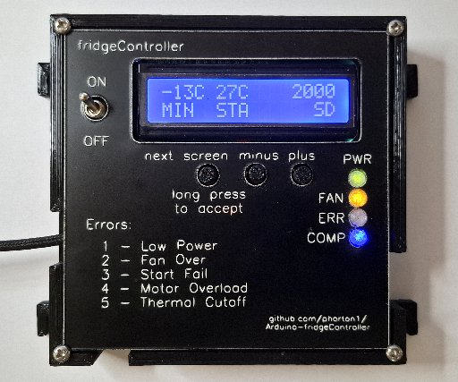
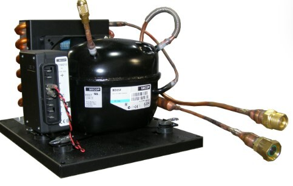
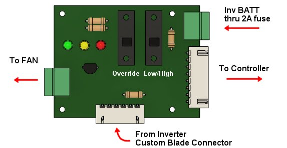
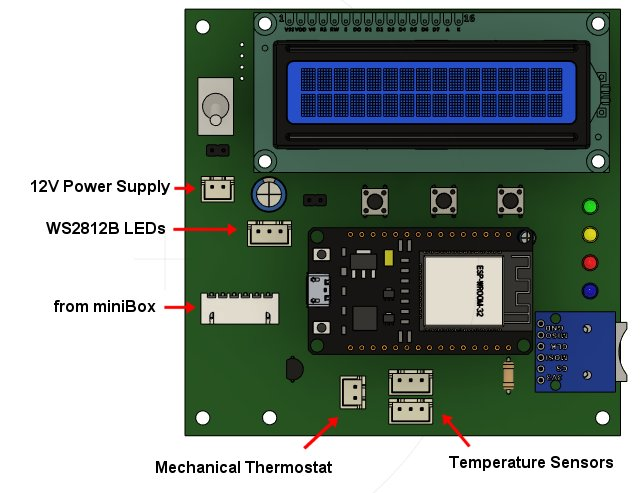

# fridgeController - for Danfoss BD35/BD50 w/12V Inverter

**Home** --
**[Design](design.md)** --
**[Electronics](electronics.md)** --
**[Build](build.md)** --
**[Notes](notes.md)** --
**[Analysis](analysis.md)**

The original **Waeco Adler Barbour Cold Machine Board F-1886 Rev2** used on
my boat's refrigeration system burned out.  It has failed several
times, and from the beginning, and over the 17 years I have had the boat,
I have jury rigged solutions for controlling the temperature of the freezer,
having indicator lights that I can see, and so forth.

The compressor is a **Danfoss BD50** and uses the typical **12V Inverter Module**
to actually run the compressor.  For many years I fought with water cooling the
refrigerator, but after changing many hoses and pumps, over and over, I decided
to just let it be air cooled.

In any case I have decided to trash the original controller board and wiring harness,
and build my own **ESP32** based **Thermostat and Controller** using my
[**myIOT**](https://github.com/phorton1/Arduino-libraries-myIOT)
architecture to also provide a consistent **WebUI** and remote monitoring capabilities.

The circuit will NOT include a relay to control a water cooling pump, but that
could easily be added.

Unfortunately there are no schematics of the Danfoss Inverter and so I have had
to [reverse engineer](analysis.md) it's behavior empirically.   I have two different units.
There is an **101N0212** currently on the pump.  I also have a spare **101N0220**
I used for reverse engineering on my desk (without a compressor).

## A. Documentation Organization

The documentation of the fridgeController is broken up into several pages:

- **home** - this page, which includes an Overview of the design
- **[Design](design.md)** - detailed design, including parameters & behavior
- **[Electronics](electronics.md)** - circuit schematics and PCB's
- **[Build](build.md)** - 3D printing, assembly, and installation
- **[Notes](notes.md)** - Implementation Notes for the fridgeController
- **[Analysis](analysis.md)** - A *detailed analysis* of the **101N0212/101N0220 Danfoss/Secop**
  Inverter behavior.
  

## B. Design Overview

Physically, I have decided to break the physical design into two
circuits.  Each part will have a PCB and a 3D printed box..

The first part is the **miniBox** which is relatively simple, and
which will sit atop the inverter in a 3D printed enclosure.  The
second part will be the more complicated ESP32 based **Controller**
which will live in a kitchen cabinet and have an external WS2812b
LED.

### miniBox

The **miniBox** is intended to remain in place and be testable,
and nominally usable, without the controller being present.
It allows the compressor to be run via **2 switches**, at low or
high speed in the event the ESP32 based controller fails,
or is not present (i.e. in development or being repaired).
It has the following connectors:

- has a **2 pin Phoenix plug** for 12V input from the
  inverter's main BATT+ and BATT- terminals
- has a **2 pin Phoenix plug** for FAN+ and FAN- output
  to the 12V 0.6A FAN
- has a **6 pin JST connector** for input from the other 6 terminals
  (FAN/DIODE+, FAN-, DIODE-, C, P, and T) from the inverter
- has an **8 pin JST connector** for output to the ESP32 based
  controller

The miniBox has three indicator LEDs

- **GREEN** to show when the inverter box generally has power.
- **YELLOW** to show when the FAN is on.
- **RED** for the flashing diagnostic diode.

The miniBox has two switches that allow the compressor to
be run in an emergency, in the absence of a controller, or
generally, to override the controller.

- **OVERRIDE** - Turns the pump on, overriding the (possibly missing)
  controller.
- **LOW/HIGH SPEED** - Controls the speed of the compressor if
  OVERRIDE is turned on.

As mentioned before, the compressor can be run and used
with just the miniBox.  In the even that it fails for some
reason, it may quickly be removed, and as long as the main
12V power supply to the inverter, the compressor can be
run at low speed by merely shorting the T&C pins on the
inverter.

### Controller

The Controller sits in a cabinet out of view.
It is based on an **ESP32** and has **WIFI Connectivity**
The Controller has the following connectors:

- a **2 pin JST connector** for the **12V power supply** input for the Controller.
- a **6 pin JST connector** for the other 6 pins of the 8 pin cable
  **from the miniBox**.
- two **3 pin JST connectors** for connecting **DS18B20 temperature
  sensors**
- a single **2 pin JST connector** for connection to an optional
  **mechanical thermostat**
- a **3 pin JST connector** for output to an external **WS2812B
  LED*s* that can be mounted on the controller, and/or outside
  of the cabinet for a general visual indication of the state
  of the freezer.

Initially the Controller will be powered by breaking the BATT+ and
BATT- wires of the 8 pin cable from the miniBox into a separate 2 pin
JST connector.  Later, if so desired, the Controller can be powered
by a separate connection to the boat's batteries so that the Inverter
power supply can be turned off and on as needed without necessarily
rebooting the ESP32, thus allowing the Controller to detect and alert
me to refrigerator power problems,

The Controller generally has a number of physical features:

- **on/off switch**
- 16x2 character **Blue LCD** display
- an **SD Card** for storing refrigerator **history** and **logfiles**
- three **buttons** for direct programming of the Controller
- four **indicator LEDs** (green, yellow, red, and blue)

The Controller can be programmed (temperature cutoffs, general
configuration) using the 3 buttons and the LCD screen.
In addition, or perhaps primarily, though, it will have a
**Web User Interface** that can be accessed from a phone,
laptop, or other programs on the boat's LAN, and will function
as a **myIOT** device.

## Please Also See

This project directly makes direct use of my
[**MyIOT**](https://github.com/phorton1/Arduino-libraries-myIOT)
("my internet of things*) repository, which provides a generalized approach to
building relatively simple parameter driven ESP32 devices that include a Web UI.

Other projects that also make user of the *myIOT* repository include the
[**Bilge Alarm**](https://github.com/phorton1/Arduino-bilgeAlarm)
that I built for my boat, and
[**Wooden Geared Clock**](https://github.com/phorton1/Arduino-theClock3)
that uses an electromagnet to drive a pendulum, and the
[**Wire Cutter and Stripper**](https://github.com/phorton1/Arduino-wireStripper32)
that I most recently made.

The PCBs (printed circuit boards) were **milled** using the
[**cnc3018**](https://github.com/phorton1/Arduino-esp32_cnc3018) CNC
machine that I built.

I hope you will take a few minutes to check out some of these other pages too!!

## Credits

This project directly relies upon the public open source Arduino development system,
the Espressif ESP32 online documentation and additions to the Arduino IDE, as
well as a number open source Arduino libraries

I would like to thank the countless individuals who have contributed to making these
development tools, source codes, and documentation available for free public use, including,
but not limited to:

- [KiCad](https://www.kicad.org/)
- [FlatCAM](https://bitbucket.org/jpcgt/flatcam/downloads/) by **Juan Pablo Caram**
- [Arduino IDE and Libraries](https://www.arduino.cc/)
- [Espressif Systems](https://www.espressif.com/en/products/socs/esp32)
- [Adafruit NeoPixel Library](https://github.com/adafruit/Adafruit_NeoPixel)
- **jQuery**, **Bootstrap**, and the [jqPlot](**http://www.jqplot.com/) javascript libraries

## License

This program, project, and repository is free software: you can redistribute it and/or modify
it under the terms of the GNU General Public License Version 3 as published by
the Free Software Foundation.

These materials are distributed in the hope that they will be useful,
but WITHOUT ANY WARRANTY; without even the implied warranty of
MERCHANTABILITY or FITNESS FOR ANY PARTICULAR PURPOSE.  See the
GNU General Public License for more details.

Please see [LICENSE.TXT](../LICENSE.TXT) for more information.

[**Next:**](design.md) A look at the detailed design of the fridgeController ...

